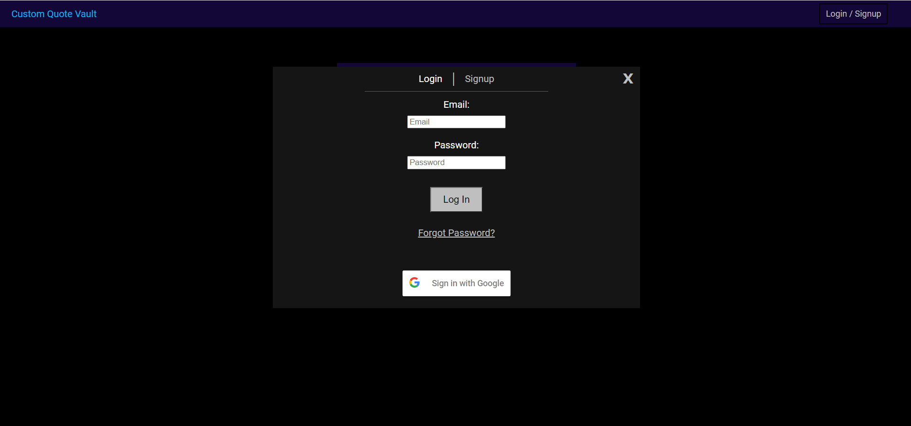
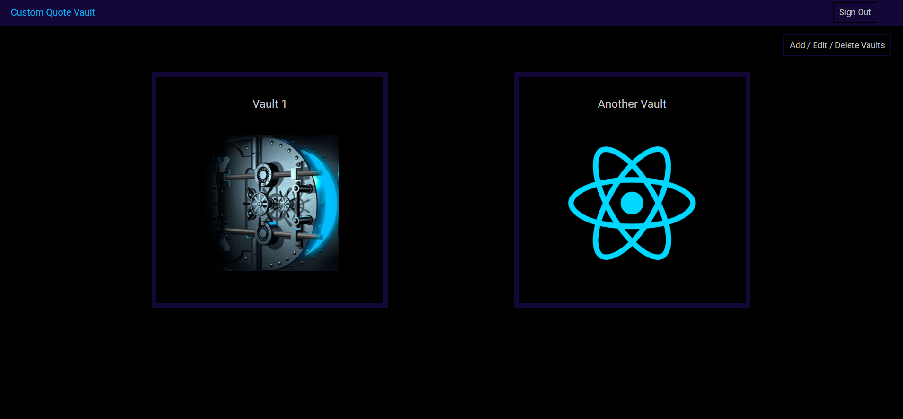
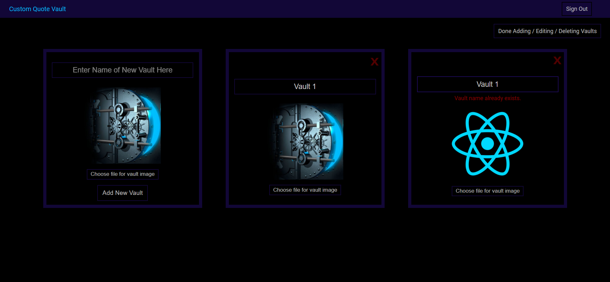
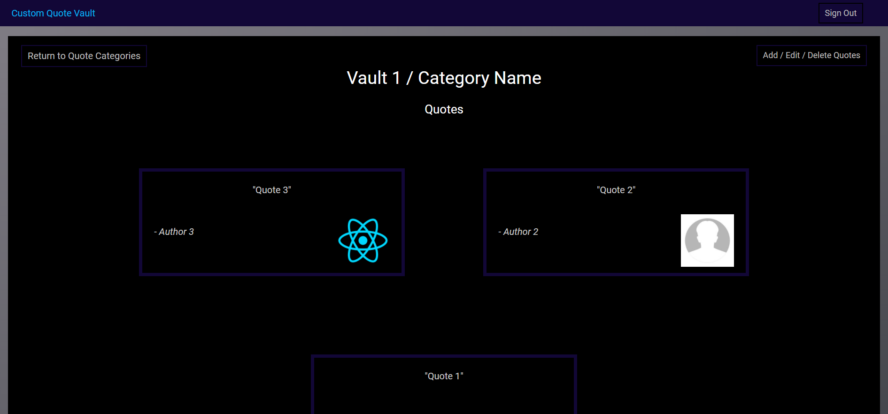

# Custom-Quote-Vault
### A full stack web application where a user can create an account or sign in with Google and add, store, categorize, and edit quotes.

### Access the application from any device and browser here: https://custom-quote-vault.herokuapp.com/

#### Features:
- Fully responsive
- Mobile-friendly
- User authentication
- User can make an account or sign in with Google
- Reset password functionality
- Validation
- Styling
- Image uploading
- Functionality for adding, editing, and deleting quotes and categories
- Fade effects
- Modals

#### Technologies Used:
- HTML
- CSS
- JavaScript
- ReactJS
- Redux
- React-Router
- Styled Components
- Express
- MongoDB/Mongoose
- NodeJS
- Cloudinary
- Heroku

